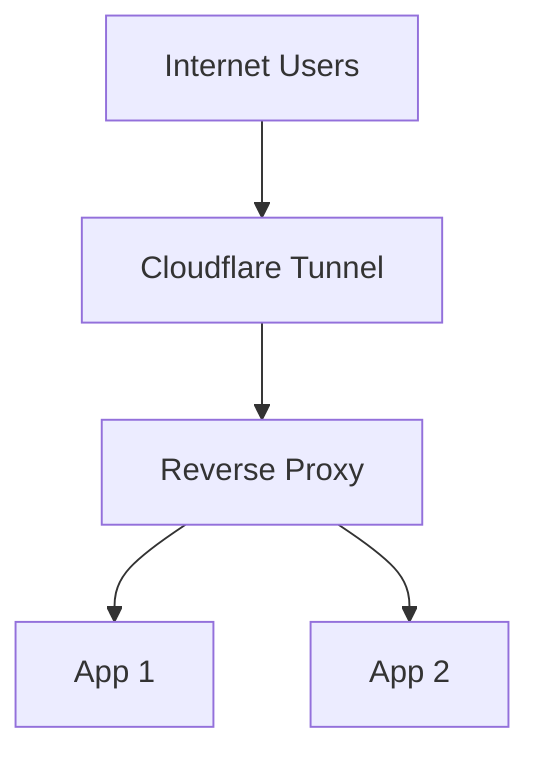

# Bring Your Own Reverse Proxy

> This builds on the [Getting Started guide](/getting-started/), and it is recommended to read that first.

This example configures cloudflared to send all traffic to a reverse proxy, and then configure routing in the reverse proxy.



## Motivation

Cloudflare tunnels can forward traffic to an existing reverse proxy. This is useful when:

- You have significant existing reverse proxy configuration
- You require reverse proxy functionality that cloudflared does not have
- You want to keep reverse proxy configuration modular
- You use a service mesh with its own ingress implementation
- You have multiple load balancers pointing at your ingress (e.g., metallb + DNS entries for same-network access)

## What we'll set up

1. Deploy cloudflare-operator and configure a cluster tunnel
2. Deploy ingress-nginx as a reference reverse proxy, pointing the tunnel to it
3. Deploy an example application behind nginx with an ingress resource

::: tip
We use a ClusterTunnel in this example, but a namespaced Tunnel works the same way. We also skip HTTPS with the reverse proxy for simplicity — commented snippets are included to enable it.
:::

## Prerequisites

1. `kubectl` is installed
2. `kustomize` is installed
3. `helm` is installed
4. [Authentication secret deployed](/examples/authentication)
5. [Cloudflare-operator installed](/getting-started/)
6. [Tunnel/ClusterTunnel deployed](/examples/tunnel-simple)

## Manifests

### Cloudflare Operator resources

::: code-group

```yaml [cluster-tunnel.yaml]
apiVersion: networking.cfargotunnel.com/v1alpha2
kind: ClusterTunnel
metadata:
  name: example-tunnel
spec:
  newTunnel:
    name: my-k8s-tunnel
  cloudflare:
    email: email@example.com
    domain: example.com
    secret: cloudflare-secrets
    # accountId and accountName cannot be both empty.
    # If both are provided, Account ID is used if valid, else falls back to Account Name.
    accountName: <Cloudflare account name>
    accountId: <Cloudflare account ID>
```

```yaml [tunnel-binding.yaml]
apiVersion: networking.cfargotunnel.com/v1alpha1
kind: TunnelBinding
metadata:
  name: ingress-nginx
subjects:
  # this example assumes you are exposing services with your reverse proxy without certificates.
  # In general this is not recommended
  - name: wildcard
    spec:
      fqdn: "*.<domain>"
      target: http://ingress-nginx-controller.ingress-nginx.svc.cluster.local:80
      noTlsVerify: true

#  # this example assumes you are generating certificates for your reverse proxy using e.g. cert-manager
#  # you should use only one of the following two configurations, not both.
#  - name: wildcard
#    spec:
#      fqdn: "*.<domain>"
#      target: https://ingress-nginx-controller.ingress-nginx.svc.cluster.local:443

tunnelRef:
  kind: ClusterTunnel
  name: example-tunnel
```

:::

### Ingress-nginx (reverse proxy)

::: code-group

```yaml [kustomization.yaml]
apiVersion: kustomize.config.k8s.io/v1beta1
kind: Kustomization
namespace: ingress-nginx

resources:
  - resources/namespace.yaml

helmCharts:
  - includeCRDs: true
    name: ingress-nginx
    namespace: ingress-nginx
    releaseName: ingress-nginx
    repo: https://kubernetes.github.io/ingress-nginx
    valuesFile: values.yaml
    version: 4.12.1
```

```yaml [namespace.yaml]
apiVersion: v1
kind: Namespace
metadata:
  name: ingress-nginx
spec: {}
```

```yaml [values.yaml]
defaultBackend:
  enabled: true

controller:
  service:
    type: ClusterIP

#   # this config allows your services to read the IP address from connecting clients
#   config:
#     enable-real-ip: "true"                     # tell nginx to trust the header we pick up from Cloudflare
#     forwarded-for-header: "CF-Connecting-IP"   # remap this header (from CF tunnel) to x-forwarded-for
#     use-forwarded-headers: "true"              # keep/pass X-Forwarded-*
#     # trust setting the x-forwarded-for header from all pods in k8s.
#     # Ideally this would be only the CF tunnel pods.
#     proxy-real-ip-cidr: <your-cluster-pod-cidr>
```

:::

### Example application (hello)

::: code-group

```yaml [deployment.yaml]
apiVersion: apps/v1
kind: Deployment
metadata:
  name: hello-demo
  labels:
    app: hello-demo
spec:
  replicas: 1
  selector:
    matchLabels:
      app: hello-demo
  template:
    metadata:
      labels:
        app: hello-demo
    spec:
      containers:
        - name: hello
          image: nginxdemos/hello:latest
          ports:
            - containerPort: 80
          readinessProbe:
            httpGet:
              path: /
              port: 80
            initialDelaySeconds: 3
            periodSeconds: 5
          livenessProbe:
            httpGet:
              path: /
              port: 80
            initialDelaySeconds: 10
            periodSeconds: 30
```

```yaml [service.yaml]
apiVersion: v1
kind: Service
metadata:
  name: hello-demo
  labels:
    app: hello-demo
spec:
  type: ClusterIP
  selector:
    app: hello-demo
  ports:
    - name: http
      port: 80
      targetPort: 80
```

```yaml [ingress.yaml]
apiVersion: networking.k8s.io/v1
kind: Ingress
metadata:
  name: hello-demo
  annotations: {}
#    # uncomment if you are using cert-manager for TLS
#    cert-manager.io/cluster-issuer: "letsencrypt-prod"
spec:
  ingressClassName: nginx
  rules:
    - host: hello.<domain>
      http:
        paths:
          - path: /(.*)
            pathType: Prefix
            backend:
              service:
                name: hello-svc
                port:
                  number: 80
#  # optional: enable if you have cert manager or TLS secret
#  tls:
#    - hosts:
#        - hello.example.com
#      secretName: hello-tls
```

:::

## Steps

1. Replace all `<like-this>` placeholder values in the manifests above.

2. Deploy the TunnelBinding:
   ```shell
   kubectl apply -f tunnel-binding.yaml
   ```

3. Deploy the reverse proxy:
   ```shell
   kustomize build --enable-helm ingress-nginx/ | kubectl apply -f -
   ```

4. Deploy the example application:
   ```shell
   kubectl apply -f hello/
   ```

5. Access the service on `hello.<domain>`

## Extending this example

### Custom SSO

Example using ingress-nginx and authelia:

```yaml
apiVersion: networking.k8s.io/v1
kind: Ingress
metadata:
  name: <app>
  annotations:
    cert-manager.io/cluster-issuer: "letsencrypt-prod"
    nginx.ingress.kubernetes.io/rewrite-target: /
    nginx.ingress.kubernetes.io/auth-method: "GET"
    nginx.ingress.kubernetes.io/auth-url: "http://authelia.authelia.svc.cluster.local:8080/api/authz/auth-request"
    nginx.ingress.kubernetes.io/auth-signin: "https://authelia.<domain>?rm=$request_method"
    nginx.ingress.kubernetes.io/auth-response-headers: "Remote-User,Remote-Name,Remote-Groups,Remote-Email"
```

### Using cloudflared for routing alongside ingress-nginx

You can add routes that bypass the reverse proxy when needed:

```yaml
apiVersion: networking.cfargotunnel.com/v1alpha1
kind: TunnelBinding
metadata:
  name: authelia
  namespace: authelia
subjects:
  - name: authelia
tunnelRef:
  kind: ClusterTunnel
  name: example-tunnel
---
apiVersion: networking.cfargotunnel.com/v1alpha1
kind: TunnelBinding
metadata:
  # Prefix with zz- to ensure this is the last route in cloudflared's config
  # (cloudflared processes routes in order)
  name: zz-ingress-nginx
subjects:
  - name: wildcard
    spec:
      fqdn: "*.<domain>"
      target: https://ingress-nginx-controller.ingress-nginx.svc.cluster.local:443
tunnelRef:
  kind: ClusterTunnel
  name: example-tunnel
```
