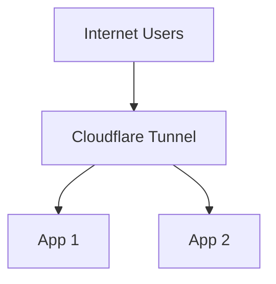

# Using Cloudflared as the Reverse Proxy

> This builds on the [Getting Started guide](/getting-started/), and it is recommended to read that first.

This example shows how to configure cloudflared to route to two (or more) applications you are hosting.



## Motivation

Cloudflared is designed to work as a reverse proxy, routing directly to your applications. This is the simplest configuration and does not need an additional reverse proxy. All routing is handled by TunnelBinding resources managed by this controller.

## Prerequisites

1. `kubectl` is installed
2. [Authentication secret deployed](/examples/authentication)
3. [Cloudflare-operator installed](/getting-started/)
4. [Tunnel/ClusterTunnel deployed](/examples/tunnel-simple)

## Steps

1. Deploy the example applications:
   ```shell
   kubectl apply -f manifests/whoami-1/
   kubectl apply -f manifests/whoami-2/
   ```

2. Deploy the TunnelBinding:
   ```bash
   kubectl apply -f manifests/cloudflare-operator/tunnel-binding.yaml
   ```

3. Verify connectivity. The service name and tunnel domain are used for the DNS record. In this case, `whoami-1.example.com` and `whoami-2.example.com` would be added.
