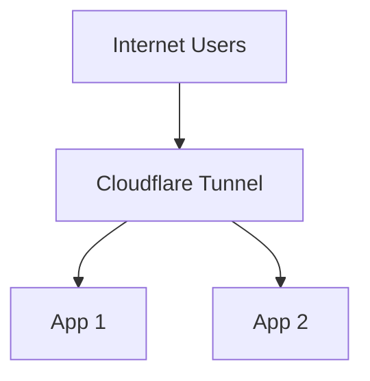

# Using Cloudflared as the Reverse Proxy

> This builds on the [Getting Started guide](/getting-started/), and it is recommended to read that first.

This example shows how to configure cloudflared to route to two (or more) applications you are hosting.



## Motivation

Cloudflared is designed to work as a reverse proxy, routing directly to your applications. This is the simplest configuration and does not need an additional reverse proxy. All routing is handled by TunnelBinding resources managed by this controller.

## Prerequisites

1. `kubectl` is installed
2. [Authentication secret deployed](/examples/authentication)
3. [Cloudflare-operator installed](/getting-started/)
4. [Tunnel/ClusterTunnel deployed](/examples/tunnel-simple)

## Manifests

### Example applications

::: code-group

```yaml [whoami-1/deployment.yaml]
apiVersion: apps/v1
kind: Deployment
metadata:
  name: whoami-1
spec:
  selector:
    matchLabels:
      app: whoami-1
  template:
    metadata:
      labels:
        app: whoami-1
    spec:
      containers:
        - name: whoami
          image: traefik/whoami
          resources:
            limits:
              memory: "128Mi"
              cpu: "500m"
          ports:
            - containerPort: 80
```

```yaml [whoami-1/service.yaml]
apiVersion: v1
kind: Service
metadata:
  name: whoami
spec:
  selector:
    app: whoami-1
  ports:
    - port: 80
      targetPort: 80
```

```yaml [whoami-2/deployment.yaml]
apiVersion: apps/v1
kind: Deployment
metadata:
  name: whoami-2
spec:
  selector:
    matchLabels:
      app: whoami-2
  template:
    metadata:
      labels:
        app: whoami-2
    spec:
      containers:
        - name: whoami
          image: traefik/whoami
          resources:
            limits:
              memory: "128Mi"
              cpu: "500m"
          ports:
            - containerPort: 80
```

```yaml [whoami-2/service.yaml]
apiVersion: v1
kind: Service
metadata:
  name: whoami-2
spec:
  selector:
    app: whoami-2
  ports:
    - port: 80
      targetPort: 80
```

:::

### ClusterTunnel

```yaml
apiVersion: networking.cfargotunnel.com/v1alpha2
kind: ClusterTunnel
metadata:
  name: k3s-cluster-tunnel
spec:
  newTunnel:
    name: my-k8s-tunnel
  cloudflare:
    email: email@example.com
    domain: example.com
    secret: cloudflare-secrets
    # accountId and accountName cannot be both empty.
    # If both are provided, Account ID is used if valid, else falls back to Account Name.
    accountName: <Cloudflare account name>
    accountId: <Cloudflare account ID>
```

### TunnelBinding

```yaml
apiVersion: networking.cfargotunnel.com/v1alpha1
kind: TunnelBinding
metadata:
  name: whoami-cluster-tun
subjects:
  - name: whoami-1  # Points to the first service
  - name: whoami-2  # Points to the second service
tunnelRef:
  kind: ClusterTunnel
  name: k3s-cluster-tunnel
```

## Steps

1. Deploy the example applications:
   ```shell
   kubectl apply -f whoami-1/
   kubectl apply -f whoami-2/
   ```

2. Deploy the TunnelBinding:
   ```bash
   kubectl apply -f tunnel-binding.yaml
   ```

3. Verify connectivity. The service name and tunnel domain are used for the DNS record. In this case, `whoami-1.example.com` and `whoami-2.example.com` would be added.
